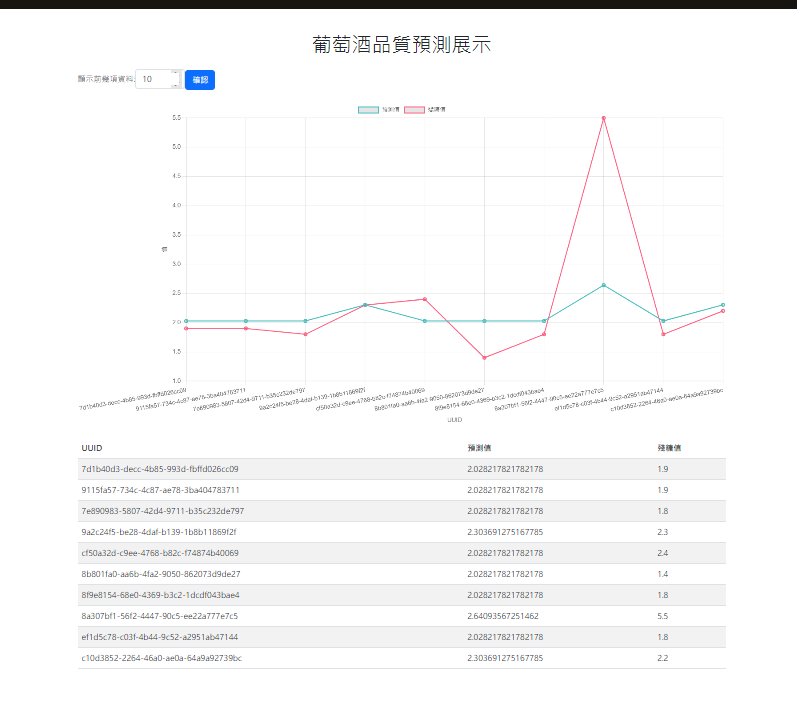

# S_ML
這是一個 demo，旨在展示方法。
流程圖(線上更新)
https://docs.google.com/drawings/d/1RFKfnPxElctGqfn72ukrSXaJ9x4Rbvs2ob_SG469kb4/edit?hl=zh-tw

## 測試前置要求

確保 Spark、RabbitMQ、PostgreSQL 和 Redis 已配置好環境，並使用 `.env` 文件設定連線。

### 安裝基本環境後

在 PostgreSQL 上建立 ODS（Operational Data Store）、DWH（Data Warehouse）和 DM（Data Mart）三個 Schema：

- **ODS（Operational Data Store）**：存放操作數據，支持當前操作需求，數據詳細且臨時。
- **DWH（Data Warehouse）**：存放整合的歷史數據，支持戰略決策和數據分析。
- **DM（Data Mart）**：針對特定業務部門或功能的子集數據存儲，從數據倉庫中提取數據並進行優化。

### 插入測試資料

在 `notebooks` 目錄下有 [insert_test_data](notebooks/insert_test_data.ipynb)，可以直接用來灌測試資料。

資料來源：
- [紅酒數據](https:archive.ics.uci.edumlmachine-learning-databaseswine-qualitywinequality-red.csv)
- [白酒數據](https:archive.ics.uci.edumlmachine-learning-databaseswine-qualitywinequality-white.csv)

### 現有的 Jobs 和 Worker

1. 已經有一個 jobs（`test_001.py`），可以將資料丟到 Redis 並發送到 RabbitMQ 隊列 `[wine_quality_predictions]` 
2. 還有一個 worker （`test002.py`） 可以監聽 exchange `[wine_quality_exchange]`並輸出到DWH.wine_quality_predictions，可以透過其他工具掛載，測試只要使用[base_flow](notebooks/base_flow.ipynb)就能執行，
特別注意：
- RabbitMQ可能要自行建立隊列或是容器
- test002是監聽式不會自動停下會一值等待隊列是否有新資料

        
3. vue3 demo 可用[start_work](notebooks/start_work.ipynb)啟動並到127.0.0.1:8000看

根據[insert_test_data](notebooks/insert_test_data.ipynb)取得資料之後，用簡單的demo資料流整理
[base_flow](notebooks/base_flow.ipynb)最後用[start_work](notebooks/start_work.ipynb)串接成頁面
最終結果如下



## Structure

### 基礎
- `base`：包含基礎引擎和核心功能。

### 巨集
- `center`：處理重複功能，例如特定（固定）的處理方式或多次重複的功能。

### 工具
- `model`：輸出入模型。
- `tests`：pytest 測試。
- `util`：包含實用工具函數。

### 工作類型
- `jobs`：一次性（定時）作業。
- `worker`：包含持續工作的作業，如監聽 RabbitMQ 或等待檔案進入等。

### 介面
- `interface`:介面檔html等等...

## Setup

安裝所需的套件：

```bash
pip install -r requirements.txt

npm i 
```


## Future

1. 引入 Prefect 或 Airflow 排程管理工具，後台管理 PySpark，或引入 Kubernetes 後台管理。
2. 完整的文件。
3. 完善 pytest 測試。
4. 包成 docker 即裝即完成。
5. 加入vue3的簡易瀏覽功能。 OK